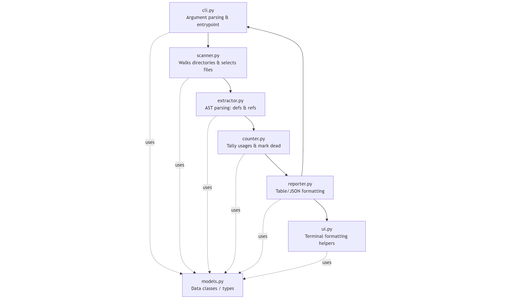

# Deadcode

A lightweight Python utility to scan source directories and report *dead code* — symbols that appear to be defined but never used (functions, classes, methods, variables, and modules). It also summarizes findings in a clean terminal view and can export machine-readable reports.

> This README is based on the repository’s structure (`cli.py`, `scanner.py`, `extractor.py`, `counter.py`, `reporter.py`, `ui.py`, `models.py`). If a flag or filename differs in your local copy, adjust accordingly.

---

## Quick start

```bash
# 1) Clone
git clone https://github.com/tellmesameer/deadcode
cd deadcode

# 2) (Optional) Use a virtual env
python -m venv .venv && \
  . .venv/bin/activate  # on macOS/Linux
# .venv\Scripts\activate              # on Windows PowerShell

# 3) Run the CLI
python cli.py --help
````

### Scan a project

```bash
# Scan your current project (recursively) and show a terminal report
python cli.py scan .
```

### Common examples

```bash
# Scan a specific folder and export JSON report
python cli.py scan ./src --json report.json

# Scan a folder but ignore tests and virtual envs
python cli.py scan . --exclude tests --exclude .venv

# Scan only Python files under app/ and lib/ and show a concise table
python cli.py scan app lib --extensions .py --table

# Treat symbols referenced fewer than 2 times as “dead”
python cli.py scan . --min-uses 2
```

> If you prefer `python -m ...` style, you can also run:
>
> ```bash
> python -m cli scan .
> ```
>
> (from the repository root).

---

## What each module does

* **`cli.py`** – Entry point and argument parsing. Defines commands like `scan`, output format flags (table/JSON), and filters (include/exclude/extension).
* **`scanner.py`** – Walks directories, collects candidate files, and orchestrates analysis.
* **`extractor.py`** – Parses Python source (AST) to extract definitions (functions/classes) and references (calls/imports/attributes).
* **`counter.py`** – Counts symbol usages and decides which items appear “unused” based on thresholds.
* **`reporter.py`** – Assembles results and formats them as pretty tables or JSON for saving.
* **`ui.py`** – Terminal UI helpers (colors, columns, truncation) to keep output readable.
* **`models.py`** – Data classes / typed containers for definitions, references, and findings.

> You don’t need to touch these files to use the tool; they’re here to keep concerns separated and the codebase maintainable.

---

## CLI reference (expected flags)

Run `python cli.py --help` to see the authoritative list. The typical flags you’ll find:

* `scan <paths...>` – One or more directories or files to analyze.
* `--extensions EXT [EXT ...]` – File extensions to include (default: `.py`).
* `--include PATTERN` – Glob to force-include specific paths.
* `--exclude PATTERN` – Glob(s) to skip (e.g., `tests`, `.venv`, `migrations`).
* `--min-uses N` – Minimum usage count; below this a symbol is flagged as dead (default: `1`).
* Output:

  * `--table` – Pretty terminal table.
  * `--json PATH` – Write a JSON report to `PATH`.
  * `--no-color` – Disable ANSI colors (useful for CI logs).

If a flag is missing in your copy, use the closest alternative visible in `--help`.

---

## Output

### Table (terminal)

```
┌─────────────┬──────────────┬──────────┬─────────────┐
│ File        │ Symbol       │ Kind     │ Used times  │
├─────────────┼──────────────┼──────────┼─────────────┤
│ app/api.py  │ get_user     │ function │ 0           │
│ lib/db.py   │ Session      │ class    │ 0           │
└─────────────┴──────────────┴──────────┴─────────────┘
```

### JSON

```json
{
  "scanned_paths": ["./src"],
  "summary": {"files": 42, "dead": 7},
  "items": [
    {"file": "src/api.py", "symbol": "get_user", "kind": "function", "uses": 0, "line": 14}
  ]
}
```
## Architecture at a glance



**Flow summary**
1. `cli.py` parses arguments and kicks off a `scan`.
2. `scanner.py` discovers files to analyze (respecting include/exclude, extensions).
3. `extractor.py` parses files (AST) to collect definitions and references.
4. `counter.py` tallies references to decide what’s likely “dead”.
5. `reporter.py` presents results (pretty table via `ui.py`, or JSON).

---

## How it works (high level)

1. **Scan**: Recursively walk provided paths and pick files that match `--extensions`.
2. **Extract**: Parse each file into an AST and collect definitions and references.
3. **Count**: Tally references per symbol to determine potential dead code (≤ `--min-uses`).
4. **Report**: Print a terminal table via `ui.py` or export JSON via `reporter.py`.

> ⚠️ Static analysis can produce **false positives**. Dynamic imports, reflection, decorators, or frameworks that use string-based lookups may hide legitimate usages from static analysis. Verify before deleting code.

---

## Usage tips

* Run in CI with `--json` and process the file to fail builds if new dead code appears.
* Start with a strict `--exclude` list (`tests`, `migrations`, generated code).
* Increase `--min-uses` to surface *nearly dead* code that’s referenced only once.
* For monorepos, point `scan` at top-level packages and run per package for clarity.

---

## Development

```bash
# Lint & format (if tools are configured in your environment)
ruff . || true
black . || true

# Run unit tests if present
pytest -q
```

---

## FAQ

**Does it delete code for me?**
No. It only reports. You choose what to remove.

**Does it analyze non-Python files?**
By default it focuses on Python (`.py`). Use `--extensions` to add more, if supported by the extractor.

**What Python versions are supported?**
Any version that your local environment and the AST parser support. If you run into parsing issues on very new syntax, try a newer Python.

---

## License

No license file was found in this repository at the time this README was written. If you intend to open-source it, add a `LICENSE` file (MIT/Apache-2.0/BSD-3-Clause are common). Until then, usage by others is restricted by default.

---

## Credits

Created by @tellmesameer. PRs and issues are welcome!

